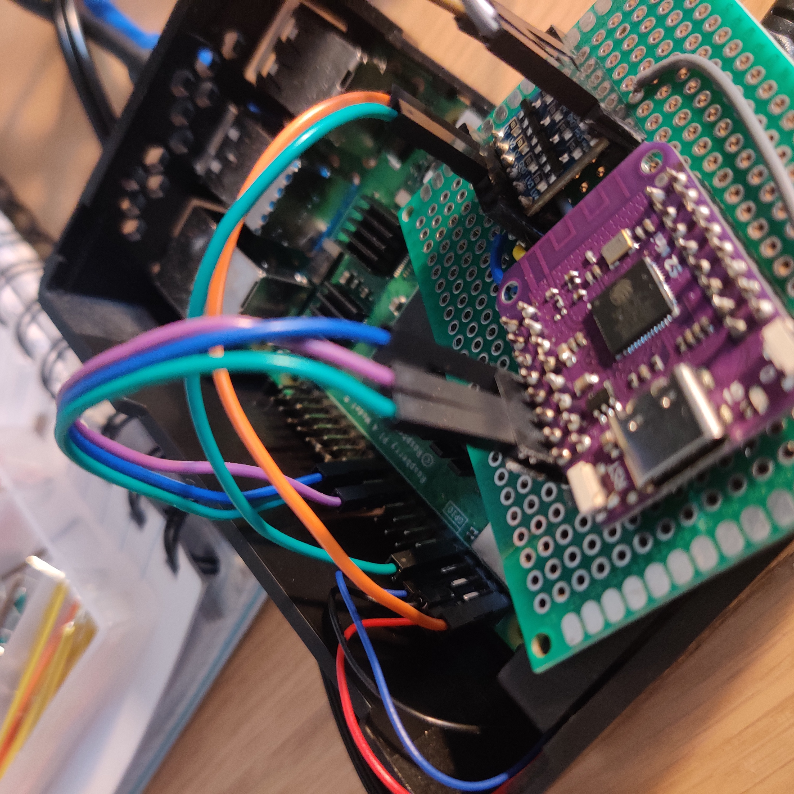

# PersonalProjectsResult

This page is for my personal projects that I do just for fun and to learn new things.

## DIY ambilights

I have always liked the effects of ambilights on Philips Tv's.I thought that for only three times the price and ~20 hours of work I too could have an ambilight TV and I decided that I wanted to try to replicate it, and I found this guide by [Awawa-dev](https://github.com/awawa-dev/HyperSPI).
I followed the instructions, the hardest part where finding hardware that played nicely with eachother. The HDMI splitter, the video grabber and the HDMI cables themself all had to match to be able to get the ambilights working AND stream that sweet 4k res.
After a couple of rounds of hardware issues I finally managed to find hardware that was cheap and worked. The image processing is done on a RPI 4. The result is sent to a ESP32 Lolin Mini which communicates with the Led Lights.

  <figure>
    

      
      
      ESP32 and RPI 4 overview. Ended up soldering the ESP32 to a breadboard so I could add bidirectional voltage shifters and keep it neat. Everything is secured in a small case.
  

</figure>

## Automatic apartment lights

After the ambilights I realized that the natural progression was to control every light in the apartment. This would also force me to write my own code for an ESP32. I hooked up some cheap sensors to an ESP32 Wemos D1 mini and got it working. The ESP32 publishes messages, using MQTT, wich the RPI subcribes too. The RPI then determines based on the sensor input what to do with the apartment lights by communicating with the smart bulbs. Currently I can turn on and off all lights by two distinct claps within some timeinterval, I do not understand why that technology disappered but I have wanted a clap-light since I was a kid. Next steps include some light and motion sensors, scaling the apartment lights based on where I am in the apartment, the time of day and how light it is at the time.   
